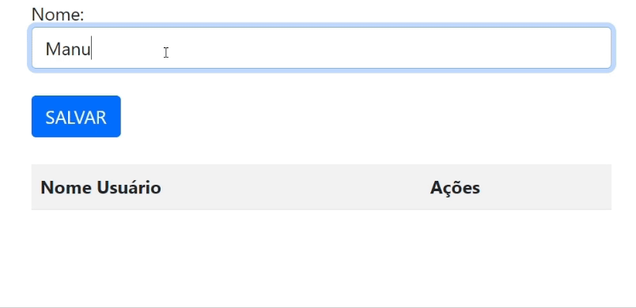

# PROJETO LOGIN COD

### ÍNDICE 

* [Introdução](#introdução)
* [Descrição](#descrição)
* [Funcionalidades](#funcionalidades)
* [Resultados](#resultado)
* [Fontes](#fontes)
* [Autor](#autor)

## `Introdução` 
    Este projeto é uma aplicação web simples desenvolvida em JavaScript que permite aos usuários realizar login e gerenciar uma lista de nomes de usuários. O objetivo principal é criar uma interface intuitiva para autenticação de usuários e armazenamento de informações em uma tabela, com funcionalidades para adicionar, editar e excluir entradas.

## `Descrição`

### O QUE É O ``ARRAY``?

 Um array é um conjunto de valores ordenados que você o referencia com um nome e um índice. Por exemplo, você pode ter um array chamado emp que contém nomes de funcionários indexados por seus números de funcionários.

 `ARRAY.SPLICE` O método splice() altera o conteúdo de uma lista, adicionando novos elementos enquanto remove elementos antigos. Índice o qual deve iniciar a alterar a lista. Se maior que o tamanho total da mesma, nenhum elemento será alterado. Se negativo, irá iniciar a partir daquele número de elementos a partir do fim.

        * TELA LOGIN

    A função acessar() valida se os campos de email e senha estão preenchidos. Se algum campo estiver vazio, exibe um alerta. Caso contrário, redireciona o usuário para a página cadastro.html

        * TELA CADASTRO 

    ``salvarUser()``: Adiciona o nome do usuário a um array (dadosLista) e atualiza uma tabela HTML com uma nova linha contendo o nome e botões para editar e excluir. Limpa o campo de entrada após adicionar o nome.`

    ``criarlista()``: Gera e exibe uma tabela HTML com os nomes armazenados no array dadosLista. Inclui botões para editar e excluir cada entrada.

    ``editar(i)``: Permite editar um nome na lista. Preenche o campo de entrada com o nome selecionado e remove o nome do array.

    ``excluir(i)``: Remove um nome da lista e da tabela HTML com base na posição fornecida.

## `Funcionalidades`

        O código permite a validação de login e o gerenciamento de uma lista de usuários, incluindo funcionalidades para adicionar, editar e excluir nomes.

## `Resultado` 

## `Fontes`

[CHAT GPT](https://chatgpt.com/)

[MDN WEB DOCS](https://developer.mozilla.org/pt-BR/docs/Web/JavaScript/Guide/Indexed_collections)

## `Autor`

[Leonardo Rocha](https://github.com/LeonardoRochaMarista)

[Manuela Araujo](https://github.com/manuelaaraujo)